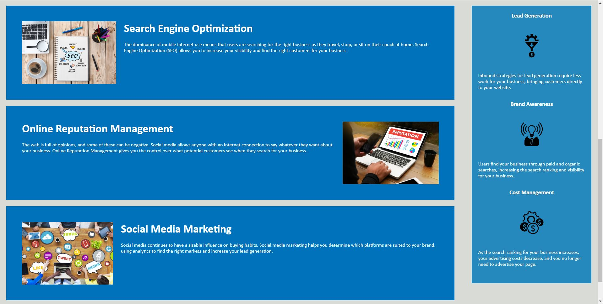
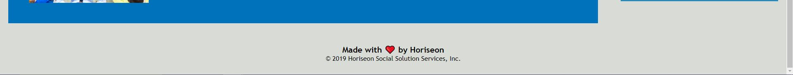

# Horiseon Module 1 Challenge# 

## Description

Given a mock website's HTML and CSS codes, I was tasked to optimize the coding to consolidate and organize the CSS stylesheet to follow a semantic structure. I consolidated the code by eliminating dry code.

## Installation

N/A

## Usage

Deployed URL: 

Due to the length of the application, I took 3 screenshots:

## Credits

N/A

## License

N/A

